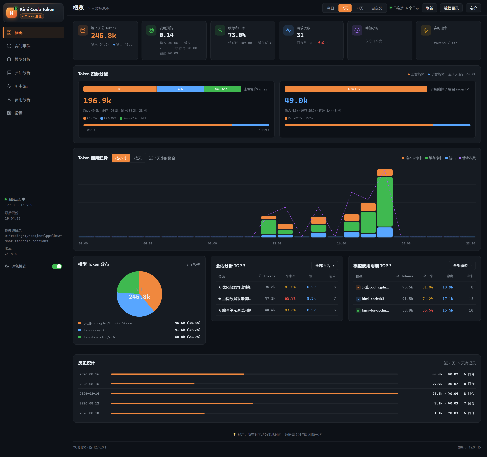
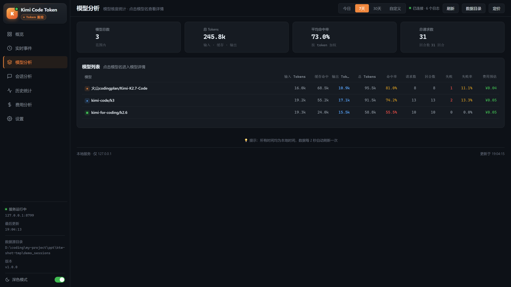
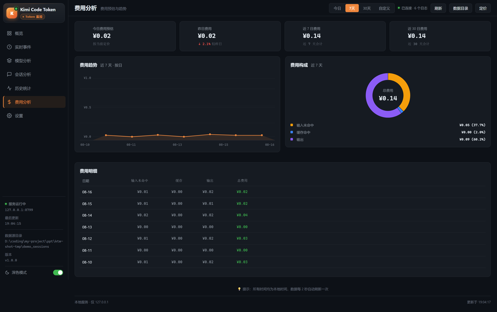
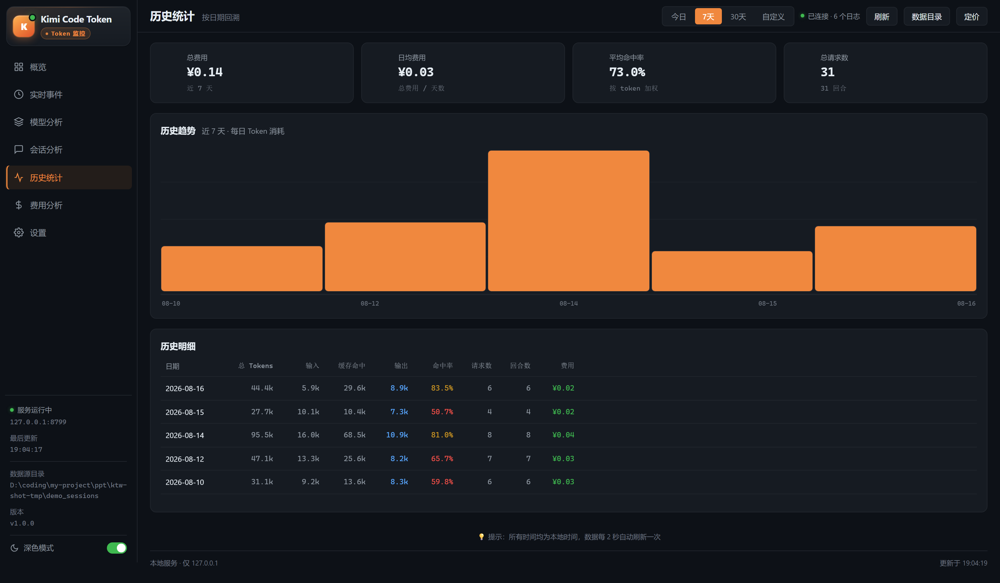

# Kimi Code Token 监控

> **非官方社区项目**：本项目与 Moonshot AI / Kimi 官方无任何关联，数据仅存储在本地，不会上传任何内容。

Kimi Code CLI 的本地 Token 用量监控面板。Python 后台扫描 `~/.kimi-code/sessions` 下的 `wire.jsonl` 日志，增量解析 `usage.record` / `llm.request` / `turn.ended` 事件并聚合统计，通过本地 HTTP 服务 + 原生 JS 仪表盘实时展示。

**纯本地运行：服务只监听 `127.0.0.1:8787`，不联网、不上传任何数据。**

## 功能特性

- **7 个页面**：概览、实时事件、模型分析、会话分析、历史统计、费用分析、设置
- **实时事件流**：每 2 秒自动刷新，事件行可展开查看输入/输出文本，支持主/子智能体与模型筛选、分页
- **多维度统计**：按模型、按会话、按主智能体（main）/ 子智能体（agent-*）三个维度聚合
- **失败调用统计**：统计 `turn.ended` 失败回合（含错误码与错误信息），模型详情页可回溯历史失败记录
- **费用预估**：全局默认定价 + 按模型定价覆盖（元 / 百万 tokens），均可在设置页本地修改
- **内置价格目录**：内置 models.dev 价格目录（元计价），可在设置页手动同步在线更新，用户手动定价始终优先
- **历史统计**：按天聚合（自动保留 90 天），长期趋势与明细表；概览页趋势图支持按小时 / 按天切换
- **时间筛选**：今日 / 7 天 / 30 天 / 自定义时间范围（起止日期含首尾，最多 366 天），全部页面同步生效
- **多来源统计**：除 Kimi Code 外可同时接入 **ZCode**（`~/.zcode` 的 SQLite 用量库）、**DSH**（`~/.dsh/sessions` 的 zstd JSONL 日志）与 **Copilot(OAI)**（VSCode oai-compatible-copilot 插件日志），顶栏来源切换一键查看单一来源或合并全部；外部源额度与 Kimi 严格分开统计（Kimi 额度看 Kimi Code 视角，外部源只看对应来源）
- **数据导出**：设置页一键导出按日 / 按模型 CSV（带 BOM，Excel 直接打开不乱码）
- **告警通知**：当日费用 / 失败次数超阈值时浏览器通知 + 页面提示，同类 30 分钟冷却不重复提醒
- **多风格界面**：内置 5 套界面风格——暗色（默认）/ 浅色 / 暖白极简 / 战术终端 / 暗夜玻璃，侧栏下拉或设置页一键切换，选择本地记忆（图表 / 徽标配色随风格自动适配）

## 界面预览

| 截图 | 说明 |
|---|---|
|  | 概览：今日用量、实时会话与费用总览 |
|  | 模型分析：按模型的用量统计与失败调用 |
|  | 费用分析：费用趋势与按模型费用占比 |
|  | 历史统计：按天 / 按小时的长期趋势 |

## 快速开始

**方式一：下载 Release**——从 [GitHub Releases](https://github.com/dustfree999/kimi-token-watcher/releases) 下载最新 `kimi-token-watcher-vX.Y.Z.zip`，解压后运行：

1. **Windows**：双击 `启动.bat`（脚本自动切换到项目目录、打开浏览器并启动本地服务）；也可以在 cmd / PowerShell 中运行：

   ```bash
   python server.py
   ```

2. **macOS / Linux**：直接运行：

   ```bash
   python3 server.py
   ```

3. 浏览器访问 **http://127.0.0.1:8787**

**方式二：源码运行**——`git clone https://github.com/dustfree999/kimi-token-watcher.git` 后同上。

**依赖**：仅需 **Python 3.10+** 标准库（`http.server` / `sqlite3` / `threading` 等），无需安装任何第三方包。**可选**：统计 DSH 用量需要 `zstandard` 包（`pip install zstandard`）；统计 Copilot(OAI) 需要 VSCode 安装 oai-compatible-copilot 插件并将 `oaicopilot.logLevel` 设为 `info` 及以上；未满足时对应采集自动跳过，Kimi / ZCode 不受影响。

**演示模式**：没有 Kimi Code 数据也能先体验——生成合成演示数据并指向它启动：

```bash
python tests/gen_demo.py demo_sessions
python server.py --dir demo_sessions
```

## 页面使用指南

- **概览**：今日 / 所选时间范围的 KPI 总览（调用数、Token、费用、失败数）、Token 资源分配、使用趋势、模型分布与会话 TOP3。
- **来源筛选**：顶栏左侧来源切换（全部 / Kimi Code / ZCode / DSH / Copilot(OAI) …），外部源有数据才出现。选中「Kimi Code」即 Kimi 自身额度（外部源不计入）；选中外部源只看该源；「全部」为合并视图（Kimi + 各外部源叠加），实时事件流同步按来源过滤。
- **实时事件**：每 2 秒自动刷新的事件流（服务端分页）；点击事件行展开查看输入/输出文本（Kimi Code / ZCode / DSH / Copilot(OAI) 均支持）；支持按主/子智能体、模型筛选与分页（10/20/50 条每页、跳至指定页）；顶部时间筛选同步生效。
- **模型分析**：按模型聚合的调用数、Token、费用与失败率；点击模型行进入详情，可回溯该模型的历史失败记录（错误码 + 错误信息）。
- **会话分析**：按会话维度聚合，展示各会话的 Token 与费用消耗，点击可看会话内明细。
- **历史统计**：按天聚合的长期趋势（自动保留 90 天），含每日明细表。
- **费用分析**：今日 / 昨日 / 7 日 / 30 日费用、费用趋势与按模型费用占比、费用明细表。
- **设置**：修改全局默认定价与按模型定价覆盖（元 / 百万 tokens）、内置 models.dev 价格目录（可手动同步在线更新，用户手动定价始终优先）、配置费用 / 失败告警阈值、一键导出按日 / 按模型 CSV。

顶部时间筛选（今日 / 7 天 / 30 天 / 自定义范围）对所有页面统一生效。

## 架构

| 模块 | 说明 |
|---|---|
| `server.py` | 入口 + HTTP 服务（路由分发、`/api/usage` 响应组装、端口冲突检测） |
| `state.py` | 共享状态（`STATE` / `LOCK` / 去重集合 `SEEN_*`）与 SQLite 持久化 |
| `aggregate.py` | 聚合槽位与记录累加（`apply_record` / `apply_request` / `apply_turn_end`，含外部源 `by_source` 分流） |
| `collector.py` | 增量扫描解析与采集循环（2 秒轮询、启动回放、历史失败回补） |
| `collector_zcode.py` | ZCode 外部源采集（SQLite `model_usage` 增量水位，rowid 去重） |
| `collector_dsh.py` | DSH 外部源采集（zstd JSONL，按文件 mtime/size 变化流式重解，消息 id 去重） |
| `collector_oai.py` | Copilot(OAI) 外部源采集（VSCode 插件日志，按字节偏移增量读取） |

前端为原生 JS 单页应用（无框架）：`index.html` + `js/`（`utils.js`、`data.js`、`render.js`、`main.js`、`charts.js`、`views.js`）+ `css/`（`base.css`、`layout.css`、`components.css`）。

采集流程：后台线程每 **2 秒**增量扫描 `~/.kimi-code/sessions/**/agents/*/wire.jsonl`（只读新追加行）→ 三层指纹去重（`is_fork_copy` 检查 → 含来源 `src` 的主指纹 → 不含 `src` 的全局兜底集合，用于超 10 分钟的历史回放）→ 累加进内存 `STATE` → 定时落库。

## 数据存储

- 数据存于项目根目录 `data.db`（SQLite，**WAL 模式**），运行期间自动出现 `data.db-wal` / `data.db-shm` 属正常现象，请勿删除
- 每 **30 秒**自动同步一次，`Ctrl+C` 退出时也会保存
- 首次启动若存在旧版 `data.json` 会自动一次性迁移（原文件改名为 `data.json.migrated-YYYYMMDD.bak`）
- 旧库升级到新版后，首次启动会**全量回补历史失败回合**（`turn.ended failed`），完成后置位跳过
- 首次启动还会在后台线程**一次性回补事件流历史**：重读最近 30 天的 wire.jsonl 与 ZCode / DSH 历史，只补进事件流展示缓冲（最多 10000 条），不动聚合统计与去重指纹，完成后置位跳过
- 外部源（ZCode / DSH / Copilot(OAI)）记录只写入 `days[date].by_source.<source>` 槽，**不进入顶层总量**（顶层严格等于 Kimi Code 自身额度），失败回合记入槽内 `failed`；去重指纹不携带时间戳（以 zcode rowid / dsh 消息 id / oai 日志行号为身份），水位失效触发整文件/全表重扫时天然幂等
- 表结构、数据流、生命周期与查询示例详见 **[docs/DATABASE.md](docs/DATABASE.md)**

## 命令行参数与 API

**命令行参数：**

| 参数 | 说明 | 默认值 |
|---|---|---|
| `--port` | 监听端口 | `8787` |
| `--dir` | sessions 根目录 | `~/.kimi-code/sessions` |
| `--zcode-db` | ZCode 用量 SQLite 路径 | `~/.zcode/cli/db/db.sqlite` |
| `--dsh-dir` | DSH sessions 根目录 | `~/.dsh/sessions` |
| `--oai-dir` | Copilot(OAI) 插件日志目录 | `~/.copilot/oaicopilot/logs` |

> 外部源自动探测默认路径，无需配置即可用；手动指定适用于路径不同的安装。

**HTTP 端点：**

| 端点 | 说明 |
|---|---|
| `GET /` | 返回仪表盘页面 `index.html` |
| `GET /api/usage` | 聚合 JSON（days / week / month / recent(最新200条) / fails / rates / prices 等） |
| `GET /api/events` | 事件流服务端分页：`?from&to&source&scope(all/main/sub/failed)&model&page&size`，返回 `{total, page, size, items, models}` |
| `GET /api/open` | 用系统资源管理器打开数据源目录 |
| `GET /js/*`、`GET /css/*` | 静态资源 |

## 常见问题

- **端口 8787 被占用 / 启动报「端口已被占用」**：说明已有一个监控实例在运行（端口冲突防护会直接退出，避免双进程同时写库）。如需重启，先在任务管理器/任务面板停止旧进程，再重新运行。
- **改了代码不生效**：服务是前台常驻进程，修改 `server.py` / 前端文件后需重启服务才生效。
- **想直接查看数据库**：服务运行期间可只读连接（WAL 支持并发读），推荐用 Navicat 或 `sqlite3` 命令行，查询示例见 **docs/DATABASE.md**。不要同时写入，避免污染数据。

## 注意事项 / 免责声明

- **采集依赖内部格式**：`wire.jsonl` 是 Kimi Code CLI 的内部存储格式，官方版本升级可能改变其结构或字段，导致采集失效或统计不准确，届时请升级本工具。
- **费用为本地估算**：费用分析基于公开定价在本地估算，仅供个人参考，不代表官方账单，实际扣费以官方账户为准。
- **纯本地、无上传**：项目只读取本地 `~/.kimi-code/sessions` 下的日志并写入本地 `data.db`，不联网、不上传任何数据；唯一的联网行为是设置页「同步在线目录」按钮（用户手动点击触发，仅拉取 models.dev 价格数据）；本工具为社区项目，与 Moonshot AI / Kimi 官方无任何关联。

## 开发与测试

- **端到端冒烟测试**（需 Node.js 与 playwright，项目内或全局 npm 安装均可）：

  ```bash
  python tests/gen_demo.py demo_sessions
  python server.py --port 8799 --dir demo_sessions   # 另开一个终端
  node tests/e2e.mjs http://127.0.0.1:8799
  ```

- **演示数据生成器**：`tests/gen_demo.py` 按 `collector.py` 实际读取的目录结构与事件 schema 生成合成数据，可用于开发调试与截图。
- 前端为无构建的原生 JS，改完刷新浏览器即可；后端改动需重启服务。

## 目录结构

```
kimi-token-watcher/
├── server.py            # 入口 + HTTP 服务
├── state.py             # 共享状态与 SQLite 持久化
├── aggregate.py         # 聚合槽位与记录累加
├── collector.py         # 增量扫描与采集循环
├── collector_zcode.py   # ZCode 外部源采集（SQLite）
├── collector_dsh.py     # DSH 外部源采集（zstd JSONL）
├── collector_oai.py     # Copilot(OAI) 外部源采集（VSCode 插件日志）
├── index.html           # 仪表盘页面
├── js/                  # 前端逻辑（6 个模块）
├── css/                 # 前端样式（3 个文件）
├── docs/DATABASE.md     # 数据库文档
├── docs/screenshots/    # README 界面预览截图
├── tests/e2e.mjs        # 端到端冒烟测试（playwright，见文件头用法）
├── tests/gen_demo.py    # 演示数据生成器（演示模式 / 开发调试）
├── 启动.bat             # Windows 一键启动脚本
├── LICENSE              # MIT
└── data.db              # 统计数据（运行时生成，不入库，见 .gitignore）
```

## License

[MIT](LICENSE) © 白泽

## 更新日志

### v1.1.0

- **新增外部数据源**：ZCode（`~/.zcode` SQLite）、DSH（`~/.dsh/sessions`）、Copilot(OAI)（VSCode 插件日志），与 Kimi Code 额度严格分开统计
- **来源筛选**：顶栏一键切换 全部 / Kimi Code / ZCode / DSH / Copilot(OAI)，聚合图表与事件流同步过滤
- **事件流服务端分页**：10 / 20 / 50 条每页可选、跳至指定页、显示总条数
- **事件流历史回补**：升级后首次启动自动重读近 30 天历史事件（幂等，不动聚合统计与去重指纹）
- **设置页重构**：定价管理与目录填充等体验改进
- **兼容性修复**：旧存档缺键 `.get` 兜底，避免 NaN / 异常

### v1.0.0

- 开源发布：MIT 协议、README、演示模式与界面截图
